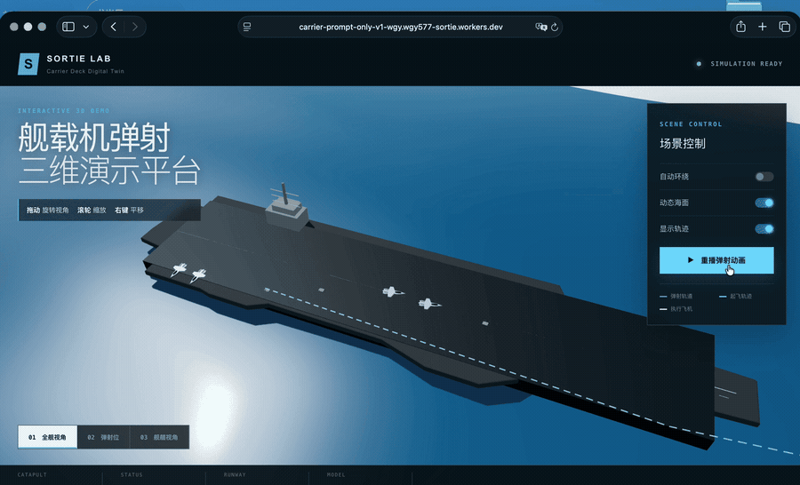
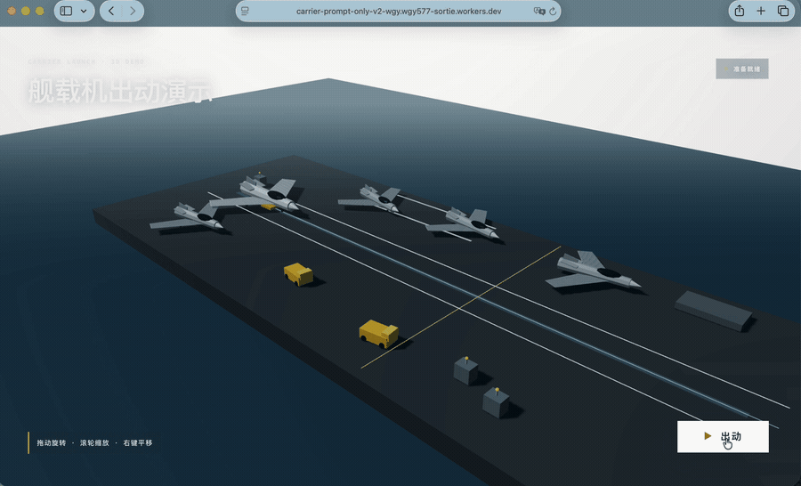

<div align="center">

# From Prompt Failure to Carrier Operations

### 从失败 GIF 到完整 3D 航母：一天内完成的多 Agent Vibe Coding 实验

**Human Review → GPT → Claude Code → Codex**


[**最终 Demo**](https://wgy-carrier-operations-demo.wgy577-sortie.workers.dev/) ·
[**原始 v1**](https://carrier-prompt-only-v1-wgy.wgy577-sortie.workers.dev) ·
[**原始 v2**](https://carrier-prompt-only-v2-wgy.wgy577-sortie.workers.dev) ·
[**Demo API**](https://wgy-carrier-operations-demo.wgy577-sortie.workers.dev/api/demo)

</div>

---

## 先看最终结果

[](https://wgy-carrier-operations-demo.wgy577-sortie.workers.dev/)

> **体验提示：** 点击上方截图即可进入最终在线 Demo，在浏览器中旋转视角、切换阴天/黄昏环境，并运行单机工序 1–8 或 PPO case 23 的 20 架协同调度。离舰飞机会保持连续加速与远距离攀升，镜头始终保留航母作为画面焦点。

这张图不是最开始生成出来的效果。它来自 **2026 年 7 月 14 日一个自然日内**的连续迭代，并在最终验收中接入二维 PPO case 23 的实际资源分配与 160 个工序时间窗：完整航母舰体、项目甲板语义、真实飞机与牵引车资产、动态牵引起点、20 架轨迹调度、连续弹射攀升、海天环境、性能档位和停止渲染保护，都是在一次次失败审查后逐层加入的。

> 本项目采用分工明确的多 Agent 流程：人负责观看结果、提出少量修正和做最终判断；GPT 生成可执行 Prompt；Claude Code 负责指导、分析和拆解；Codex 负责读取仓库、实现、测试和发布。

---

## 00 · 最开始的两次结果：快，但明显不好

| 第一次 One-shot 生成 | Claude Code 早期 2D 尝试 |
|:--:|:--:|
| [](media/01-one-shot-carrier-launch.mp4) |  |
| [GIF](media/01-one-shot-carrier-launch.gif) · [MP4](media/01-one-shot-carrier-launch.mp4) | [GIF](media/02-claude-code-catapult.gif) |

> 本节展示的是早期录制素材，不是交互式 Demo。可实际进入运行的版本从下方 v1 开始。

两个结果都可以很快表达“舰载机弹射起飞”，但问题同样明显：

- 飞机、甲板、海面和天空不属于同一视觉系统；
- 甲板只是背景或平面，没有完整舰体和舰岛体积；
- 飞机运动更像图形平移，不像真实的加速、离舰和连续攀升；
- 没有可旋转镜头，无法从侧面判断航母轮廓是否成立；
- 没有项目坐标、牵引轨迹、对象身份和重置状态；
- 输出虽然“语义正确”，但无法承担项目 Demo。

### 早期问题归因

失败原因不是模型不会生成图片或不会写 Three.js，而是当时只有目标描述，没有把项目事实、视觉标准和运行约束交给执行 Agent。

```text
只有 Prompt
   ↓
模型猜甲板、猜比例、猜运动、猜镜头
   ↓
能运行 / 能看懂主题
   ↓
但无法验证，也无法稳定继续修改
```

因此，解决方法不再是单纯把一条 Prompt 写得更长，而是建立一条能反复审查和修正的 Agent 协作链。

---

## 协作与审核闭环

```text
                 ┌──────────── 通过 ────────────▶ [结束 / 发布]
                 │
[Human / WGY 审核] ── 不通过 ──▶ [GPT] ──▶ [Claude Code] ──▶ [Codex] ──▶ [Demo]
        ▲                                                               │
        └──────────────────── 新版本返回审核 ────────────────────────────┘
```

循环的停止条件不由 Agent 自己宣布，而由人看过真实运行结果后决定。**通过就结束；不通过就把新的审查意见重新交给 GPT，进入下一轮。**

| 角色 | 在这个项目中的实际职责 |
|:--|:--|
| **Human reviewer / WGY** | 提供最初方向；观看每一版；指出“像平板”“云太假”“攀升拐直角”“Mac 发热”等直观问题；做少量提示修正、取舍和最终验收。 |
| **GPT** | 与人对话，解释画面或工程问题，把短反馈扩展成包含目标、限制、禁止项和验收标准的 Prompt。本文的大部分长 Prompt 来自 GPT，而不是人逐字编写。 |
| **Claude Code** | 作为指导 Agent，继续分析 Prompt，给出技术路线、拆分模块、补充实现约束，并把任务交给 Codex 执行。 |
| **Codex** | 作为实现 Agent，检查现有文件和项目代码，完成 Three.js 建模、资产接入、动画、状态机、性能优化、构建测试、公开边界检查和部署。 |

人没有手工编写整套 Three.js，也没有独自设计下面的 Harness。人的价值是持续审查和做判断；技术语言和执行过程主要在 Agent 之间传递。

---

## 01 · v1：第一次变成可交互的 3D 页面

[](https://carrier-prompt-only-v1-wgy.wgy577-sortie.workers.dev)
[](versions/v1-initial/)

[](https://carrier-prompt-only-v1-wgy.wgy577-sortie.workers.dev)

> **体验提示：** 点击上方 GIF 即可进入 v1 在线 Demo，在浏览器中自行旋转镜头并运行弹射演示。

▶ [**进入 v1 在线体验**](https://carrier-prompt-only-v1-wgy.wgy577-sortie.workers.dev) · [查看未经修改的历史源码](versions/v1-initial/)

**历史提交：`bb0ce0d` · 原始文件树未经美化或重写。**

v1 已经拥有动态海面、航母、代码几何飞机、弹射轨迹、三个镜头、OrbitControls 和重播。与 GIF 相比，它第一次允许用户绕着场景观察。

但进入 Demo 后仍然可以立即发现：

- 航母主要由盒体和平面组成，侧面更像浮在海上的板；
- 飞机是二维轮廓挤出，远景还能理解，换角度就很薄；
- 舰体、飞机、海面、UI 和动画集中在一个大页面；
- 位置和比例依赖硬编码，没有统一项目坐标；
- “有一个航母”与“这艘航母可信”之间仍有很大距离。

### 从 v1 得到的改进方向

v1 审查阶段，人的反馈集中在场景尺度、飞机辨识度和动画状态。GPT 将反馈整理成组件、状态和视觉要求；Claude Code 再拆分为模型、场景、动画和 UI 任务，交给 Codex 实现下一版。

---

## 02 · v2：结构变好了，但视觉仍然明显不够

[](https://carrier-prompt-only-v2-wgy.wgy577-sortie.workers.dev)
[](versions/v2-compact/)

[](https://carrier-prompt-only-v2-wgy.wgy577-sortie.workers.dev)

> **体验提示：** 点击上方 GIF 即可进入 v2 在线 Demo，在浏览器中自行操作并对比 v1 的结构和视觉变化。

▶ [**进入 v2 在线体验**](https://carrier-prompt-only-v2-wgy.wgy577-sortie.workers.dev) · [查看未经修改的历史源码](versions/v2-compact/)

**历史提交：`967375b` · 原始文件树未经美化或重写。**

v2 确实完成了一轮工程改进：

- 页面逻辑拆出 `CarrierDemo`；
- `Deck` 和 `Aircraft` 成为独立组件；
- 飞机增加机身、机翼、座舱、尾翼、喷口和简化起落架；
- 动画拥有 `preparing → launching → climbing → finished` 状态；
- 原始测试验证状态顺序、轨道方向和最终攀升姿态。

然而实际体验后，问题依然非常明显：

- 舰体仍然偏平，甲板还是通用盒体；
- 飞机和车辆依旧是代码几何体；
- 没有使用项目里的真实甲板轮廓、区域和设备位置；
- 没有 MATLAB 牵引轨迹和明确对象所有权；
- 没有可信天空、云层、海浪、尾迹和航行参考系；
- Prompt 更长了，但缺少能持续约束实现的工程环境。

**v2 表明：增加 Prompt 细节可以改善单个版本，但项目上下文、反馈闭环和回归保护仍需要由 Harness 提供。**

---

## 03 · 转折点：不再追加万能 Prompt，而是建立 Harness

从这里开始，GPT 和 Claude Code 给出的要求不再只是“画面应该更好”，而是逐步加入来源、协议、对象、测试和发布门禁。Codex 每次实现都必须在这些约束下检查现有仓库，而不是重新猜一个场景。

### Harness 控制机制参考

在本文中，Harness 指模型外部的**执行与反馈控制系统**，而不是对问题的简单罗列。

- Anthropic 将 evaluator–optimizer 描述为“生成者输出、评估者反馈、再次生成”的循环；适用前提是有清楚的评价标准，而且反馈确实能让下一版变好。[Building Effective Agents](https://www.anthropic.com/engineering/building-effective-agents)
- LangGraph 的 Human-in-the-loop 使用持久化状态、`interrupt` 和 `resume`：执行到审核点就暂停，保存当前状态，得到人的批准、修改或自然语言反馈后再恢复。这正对应本项目“人说行才结束，否则回到 GPT”的循环。[LangGraph Interrupts](https://langchain-ai.github.io/langgraph/how-tos/human_in_the_loop/wait-user-input/)
- Anthropic 对 Agent Evals 的复盘建议把代码检查、模型评价和人工评价组合起来，因为它们分别擅长客观回归、语义质量和最终判断。[Demystifying Evals for AI Agents](https://www.anthropic.com/engineering/demystifying-evals-for-ai-agents)
- OpenAI 将 Agent 的基础拆为模型、工具和指令，并建议根据真实失败不断增加 guardrails；也就是说，约束应该进入工具、执行权限和验证函数，而不只留在 Prompt 里。[A Practical Guide to Building AI Agents](https://openai.com/business/guides-and-resources/a-practical-guide-to-building-ai-agents/)
- GitHub 的 required checks 要求最新提交 SHA 上的检查成功后才能合并，提供了发布端的确定性门禁。[GitHub Required Status Checks](https://docs.github.com/en/pull-requests/collaborating-with-pull-requests/collaborating-on-repositories-with-code-quality-features/troubleshooting-required-status-checks)

结合这些实践，本项目将 Harness 划分为五个连续控制环节：

```text
输入控制           执行控制           自动验证             人工审核            发布控制
Prompt 模板  →  文件/工具/状态边界  →  Build/Test/扫描  →  看真实 Demo  →  CI 与公私隔离
    ↑                                                           │
    └──────────────── 不通过：把差异重新送回 GPT ────────────────┘
```

### 本项目的 15 个控制点：控制器、证据和失败路径

| # | 控制器 | 项目中的控制方式 | 可检查的证据 | 不满足时发生什么 |
|--:|:--|:--|:--|:--|
| 01 | **验收契约** | GPT 生成 Prompt 时固定写出 `Goal / Context / Constraints / Done when / 禁止项`，把“好看一点”改成镜头占比、对象数量、动作阶段和持续时间。 | 本 README 的 [Prompt 演进档案](#prompt-演进档案) | 不进入 Claude Code 拆解，先补齐验收条件。 |
| 02 | **人工停止条件** | 每轮生成实际 Demo 或截图供 WGY 审核；只有人工确认“通过”才终止循环。 | 最终截图、v1/v2 预览 GIF、连续审查记录 | “不通过”携带差异说明回到 GPT，不允许 Agent 自行宣布完成。 |
| 03 | **Agent 交接格式** | GPT 输出规格；Claude Code 输出模块拆分、顺序、依赖和回归点；Codex 只接收可执行任务并返回代码、构建结果和可观看产物。 | README 中的环形协作图与阶段 Prompt | 上一层交付不完整就不进入下一层，避免角色同时猜测。 |
| 04 | **仓库上下文门** | Codex 先用文件搜索定位 Python、前端、素材和轨迹；任务中显式列出允许读取的源文件和不可替换的数据源。 | [AGENTS.md](AGENTS.md) 与 Prompt 中的文件来源 | 找不到权威来源就报告缺失，不重新随机设计。 |
| 05 | **数据来源门** | 甲板、设备和轨迹都经过单一适配层；原始二维数据只通过统一转换函数进入 Three.js。 | `Python (x,y) → Three.js (X,Z)` 坐标契约 | 任一对象绕开适配器就不允许进入场景。 |
| 06 | **资产准入表** | 每个 GLB/EXR 先核对许可、文件大小、面数、透明材质、远景轮廓和前向轴；通过后才复制进私有运行项目。 | README 的资产来源链接和私有资产清单 | 许可不清或成本过高时更换候选，不进入运行资产库。 |
| 07 | **几何组件边界** | `CarrierGroup` 强制分成 `Hull / Deck / Island / Markings`；修改舰体不得覆盖甲板坐标，修改环境不得触碰 CarrierGroup。 | 最终架构命名与组件职责 | 跨边界修改在代码审查中拆回独立组件。 |
| 08 | **模型归一化管线** | GLB 单次加载；用 `Box3` 计算尺寸和最低点；固定一次前向轴后 clone，禁止每个实例分别猜缩放与旋转。 | 飞机和牵引车的一致比例、贴地效果 | 包围盒、贴地或方向检查失败时不生成实例。 |
| 09 | **实例注册表** | 运动对象使用 `launchAircraft / towAircraft / tractorMoveDemo / tractorTowDemo` 等稳定名称，静态实例进入单独集合。 | 重置逻辑和对象命名 | 未登记对象不能被动画系统控制，避免下标错绑和重影。 |
| 10 | **有限状态机** | 只允许定义好的状态迁移；动画运行时锁住其他按钮；每个状态只有一个对象控制者；reset 使用初始快照恢复。 | v2 的 [状态机](versions/v2-compact/lib/launch-machine.mjs) 与测试 | 非法转换被忽略或拒绝，不启动第二条动画循环。 |
| 11 | **轨迹连续性检查** | 位置沿路径插值，朝向取切线，弹射到攀升使用连续曲线；检查位置、速度方向和俯仰角不发生突变。 | v2 轨道测试与最终弧线攀升画面 | 出现瞬移、横滑或直角转弯时返回运动 Prompt，该轮视觉验收不通过。 |
| 12 | **视觉评估包** | 每轮固定检查舰体轮廓、飞机辨识度、甲板占比、地平线、云层高度、接触阴影和飞行连续性，并保存截图/GIF作为对照。 | 本 README 的阶段媒体 | Build 通过但视觉 rubric 不通过，仍判定该轮失败。 |
| 13 | **性能预算** | 限制 FPS 与 DPR；静态飞机数量提供档位；隐藏标签页暂停；“结束演示”取消循环并释放 WebGL；云和海面分别降级。 | 最终 Demo 的数量档位与结束按钮 | 超出热预算先降低实例/透明材质/帧率，不牺牲核心流程。 |
| 14 | **确定性验证** | 提交前执行构建、状态机测试、快照树哈希与敏感文件扫描；CI 在同一提交上重新执行。 | [.github/workflows/validate.yml](.github/workflows/validate.yml) | 任一检查失败则阻止发布分支继续合并。 |
| 15 | **发布隔离门** | v1/v2 是只读公开快照；最终源码、甲板、MAT、GLB/EXR 在私有仓库；公共仓库用脚本扫描扩展名、路径和托管标记。 | [OPEN_SOURCE_BOUNDARY.md](OPEN_SOURCE_BOUNDARY.md) · [边界扫描脚本](scripts/check-open-source-boundary.mjs) | 扫描失败立即终止提交，公开 Demo 只保留 URL、API 与截图。 |

本项目为每个 Harness 控制点定义了触发位置、执行方式、可检查证据和失败返回路径。Prompt 用于表达目标；文件边界、适配器、对象注册、状态机、测试、人工 Gate 和 CI 共同负责约束执行过程。

---

## 04 · Harness 之后，最终版具体改变了什么？

| 维度 | v1 / v2 | 最终版本 |
|:--|:--|:--|
| 航母 | 平板或盒体语义 | 根据甲板轮廓分层构造完整舰体、舰首、舰尾、水线和侧置舰岛 |
| 甲板 | 通用矩形与手猜位置 | 统一坐标系统，复用项目甲板语义、准备位、升降机与弹射器布局 |
| 飞机 / 车辆 | 代码三角形和方块 | 联网筛选 GLB，统一缩放、朝向、贴地与 clone 管线 |
| 轨迹 | 直线或插值猜测 | 指定 MATLAB 轨迹转换为前端路径点并保持来源可追溯 |
| 动画 | 单段播放 | 单机工序 1–8、牵引、准备、弹射、弧线攀升与飞向天际 |
| 对象 | 临时下标 | 明确的 launch / tow / tractor / static 实例所有权 |
| 环境 | 纯色或拼接背景 | 多层天空、低云、长短波海面、舰首浪花与持续尾迹 |
| 性能 | 一直全速渲染 | 机数档位、FPS/DPR 限制、页面隐藏暂停、结束后释放 WebGL |
| 发布 | 所有内容混在一起 | 历史版本公开、最终实现私有、Demo/API/截图分离 |

### 联网资产调研

在 Harness 阶段，Claude Code 指导资产选择条件，Codex 负责实际搜索、核对和接入。候选资产不只比较“像不像”，还检查远景轮廓、三角面数、许可、透明材质成本、前向轴和贴地难度。

- [Shenyang J31 “Gyrfalcon”](https://sketchfab.com/3d-models/shenyang-j31-gyrfalcon-23dbff530e21491299ac67bbab42b553)
- [pushback](https://sketchfab.com/3d-models/pushback-e15e6f76f18e4b02b7009df0fb018fc8)
- [Fluffy Cloud](https://sketchfab.com/3d-models/fluffy-cloud-2c887a28840f47cfae6b5dee0d11b842)
- [Kloppenheim 07 Pure Sky](https://polyhaven.com/a/kloppenheim_07_puresky)

最终运行资产不随本仓库公开。

---

## 05 · 最终版本

[](https://wgy-carrier-operations-demo.wgy577-sortie.workers.dev/)
[](https://wgy-carrier-operations-demo.wgy577-sortie.workers.dev/api/demo)

最终版展示一架舰载机从甲板保障、牵引、准备、进入弹射器到离舰并持续攀升的完整工序 1–8。用户可以绕航母观察、调整环境亮度、选择甲板机数量、单独出动，并在结束后停止渲染以释放 GPU。

- **Demo：** <https://wgy-carrier-operations-demo.wgy577-sortie.workers.dev/>
- **接口：** [`GET /api/demo`](https://wgy-carrier-operations-demo.wgy577-sortie.workers.dev/api/demo)
- **完成日期：** 2026-07-14（Asia/Shanghai）
- **开发跨度：** 一个自然日
- **最终源码：** Private
- **保持私有：** 真实甲板导出、Python 生成逻辑、MATLAB 轨迹及转换结果、GLB/EXR 运行资产和最终装配代码

---

## 一日迭代时间线

| 阶段 | 结果 | Harness 成熟度 |
|:--|:--|:--|
| 上午 · 两个 GIF | 很快表达主题，但没有可信三维空间 | `L0` Direct Prompt |
| 上午后段 · v1 | 页面可交互，但航母和飞机明显粗糙 | `L1` Visual Contract |
| 中段 · v2 | 组件和状态改善，视觉与项目数据仍然不足 | `L2` Prompt Structure |
| 下午 · Harness 转向 | 坐标、舰体、资产、轨迹、对象和状态逐层隔离 | `L3–L4` Engineering Harness |
| 晚间 · 环境与性能 | 修正云海、尾迹、连续攀升、发热和停止渲染 | `L5` Visual / Thermal Gate |
| 发布前 | v1/v2 原样公开，最终实现保持私有 | `L6` Privacy / Release Gate |

这条时间线记录了在一个自然日内完成的高密度可见迭代，以及人工审核、GPT、Claude Code、Codex 和 Harness 在各阶段承担的职责。

---

## Prompt 演进档案

> 这些长 Prompt 的主要生成链是：**Human 给出短反馈 → GPT 生成 Prompt → Claude Code 补充技术指导 → Codex 实现**。下方为可读性合并了重复路径、上传确认和按钮微调，但保留了所有关键方向变化。

<details>
<summary><strong>01 · 先生成弹射 GIF</strong></summary>

```text
使用多模态模型或代码生成 GIF。
表现舰载机弹射、加速、离舰和一小段攀升，加入天空和大海。
```

结果能表达主题，但模型、背景和运动不属于同一系统。
</details>

<details>
<summary><strong>02 · 从 GIF 转向 3D 网页</strong></summary>

```text
创建可部署的 Three.js 3D Demo。
加入甲板、弹射器、主飞机、静止飞机、牵引车和阴天海面。
使用 preparing / launching / climbing / finished 状态。
```

产生了最早交互方向，也暴露了“平板漂在海上”的问题。
</details>

<details>
<summary><strong>03 · v1：完整交互原型</strong></summary>

```text
先做可运行的完整原型：航母、飞机、动态海面、弹射轨迹、
多个镜头、OrbitControls 和重播。优先验证整体故事。
```

[Live v1](https://carrier-prompt-only-v1-wgy.wgy577-sortie.workers.dev) · [Source / bb0ce0d](versions/v1-initial/)
</details>

<details>
<summary><strong>04 · v2：紧凑场景与状态拆分</strong></summary>

```text
当前 Demo 太大、不够细节。重做为紧凑场景。
飞机必须能辨认主要部件；主飞机只有一个实例。
拆分场景、状态、模型与 UI，并运行构建和测试。
```

[Live v2](https://carrier-prompt-only-v2-wgy.wgy577-sortie.workers.dev) · [Source / 967375b](versions/v2-compact/)
</details>

<details>
<summary><strong>05 · 拒绝海上平板</strong></summary>

```text
中远距离必须一眼认出是航空母舰。
补出舰首、舰尾、船舷、吃水线以上体积和侧置舰岛。
从前、侧、后观看都不能变成薄片。
```
</details>

<details>
<summary><strong>06 · 停止凭感觉设计甲板</strong></summary>

```text
先读取已有 Python 甲板逻辑，建立唯一坐标转换。
轮廓、区域、设备、舰岛与弹射器共享同一世界坐标。
不要随机摆放，不要把截图贴到矩形平面。
```
</details>

<details>
<summary><strong>07 · 分块建模完整舰体</strong></summary>

```text
以顶部轮廓构造中层、水线层和底层截面。
舰首收尖、舰尾相对平直、侧面向水线内收。
CarrierGroup 内分离 Hull / Deck / Island。
```
</details>

<details>
<summary><strong>08 · 搜索真实资产并统一接入</strong></summary>

```text
联网筛选远景可用的舰载机、牵引车和环境资产，核对许可与成本。
GLB 只加载一次再 clone；使用 Box3 自动缩放和最低点贴地。
```
</details>

<details>
<summary><strong>09 · 真实轨迹和对象所有权</strong></summary>

```text
MATLAB 数据转换为前端路径点，但轨迹来源不能替换。
主飞机、被牵引飞机和演示牵引车使用明确命名。
任何时刻只有一个动画拥有对象控制权。
```
</details>

<details>
<summary><strong>10 · 单架飞机工序 1–8</strong></summary>

```text
不做 20 架同时调度，只演示一架飞机完整经历工序 1–8。
包括牵引、准备、进入弹射器、弹射和持续攀升。
```
</details>

<details>
<summary><strong>11 · 环境从特效回到空气感</strong></summary>

```text
丁达尔效应不能像舞台光柱。
海面叠加长波和短波；天空统一、无接缝，上方厚云、地平线开阔。
```
</details>

<details>
<summary><strong>12 · 连续飞行曲线</strong></summary>

```text
飞机不能水平飞到甲板边缘后突然直角向上。
位置、速度方向和俯仰角都连续，沿弧线攀升并继续飞向天际。
```
</details>

<details>
<summary><strong>13 · 航母航行与世界参考系</strong></summary>

```text
舰首浪花、侧边扰动和舰尾尾迹持续存在。
海面、云层和航母产生一致相对运动。
```
</details>

<details>
<summary><strong>14 · 热预算与主动停止</strong></summary>

```text
限制 FPS 和 DPR，提供静态飞机数量档位。
页面隐藏时暂停；增加结束按钮并释放 WebGL 资源。
```
</details>

<details>
<summary><strong>15 · 最终发布边界</strong></summary>

```text
最终 Demo 和真实甲板保持闭源，只公开运行入口和 API。
原样公开 v1/v2，展示 Prompt-only 失败到 Harness 系统的过程。
提交前阻止研究数据、最终资产和私有信息进入 Git。
```
</details>

---

## 开源边界

- **公开：** 原始 v1/v2 源码、对应在线体验、早期 GIF/MP4、Prompt 演进、CI 和边界检查；
- **私有：** 最终 Demo 源码、真实甲板数据、Python 生成逻辑、MATLAB 轨迹及转换结果、GLB/EXR 运行资产；
- **可访问但不开源：** [最终 Demo](https://wgy-carrier-operations-demo.wgy577-sortie.workers.dev/) 和 [`GET /api/demo`](https://wgy-carrier-operations-demo.wgy577-sortie.workers.dev/api/demo)。

详细规则见 [OPEN_SOURCE_BOUNDARY.md](OPEN_SOURCE_BOUNDARY.md)。

## 仓库结构

```text
Carrier-Vibe-Coding-Journey/
├── README.md
├── AGENTS.md
├── OPEN_SOURCE_BOUNDARY.md
├── scripts/check-open-source-boundary.mjs
├── .github/workflows/validate.yml
├── media/
└── versions/
    ├── v1-initial/    # bb0ce0d 原始文件树
    └── v2-compact/    # 967375b 原始文件树
```

## 本地运行 v1 / v2

```bash
node scripts/check-open-source-boundary.mjs

cd versions/v1-initial
npm ci
npm run build
npm run dev

cd ../v2-compact
npm ci
npm test
npm run dev
```

v1/v2 是未经美化的 Prompt-only 历史证据。它们的不足不是需要隐藏的瑕疵，而是理解 Harness 为什么必要的对照组。

## License

本仓库中的原创公开代码与文档采用 [MIT License](LICENSE)。最终私有 Demo、研究数据和未随仓库提供的第三方资产不在此许可范围内。

---

<div align="center">

**The human reviewed. GPT wrote the prompt. Claude Code directed. Codex built. The Harness kept it coherent.**

Created by **Guangyu Wu (WGY)** · 2026-07-14

</div>
