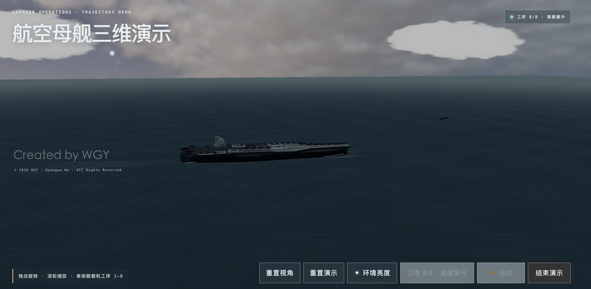
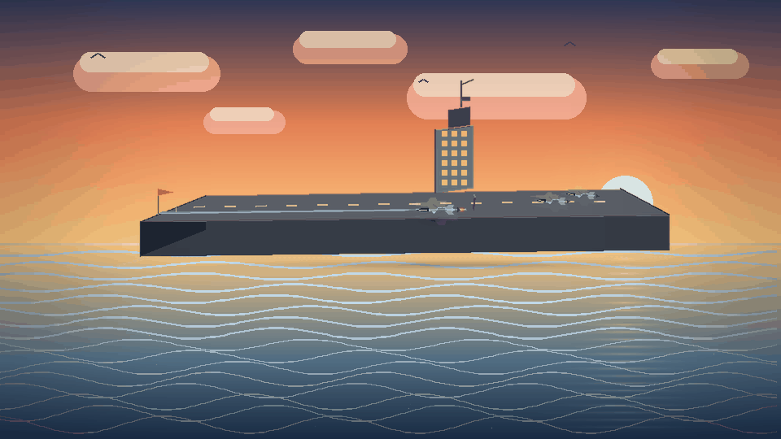

<div align="center">

# From Prompt Failure to Carrier Operations

### 从失败 GIF 到完整 3D 航母：一天内完成的多 Agent Vibe Coding 实验

**Human Review → GPT → Claude Code → Codex**


[**最终 Demo**](https://wgy-carrier-operations-demo.wgy577-sortie.workers.dev/) ·
[**原始 v1**](https://carrier-prompt-only-v1-wgy.wgy577-sortie.workers.dev) ·
[**原始 v2**](https://carrier-prompt-only-v2-wgy.wgy577-sortie.workers.dev) ·
[**Demo API**](https://wgy-carrier-operations-demo.wgy577-sortie.workers.dev/api/demo)

</div>

---

## 先看最终结果

[](https://wgy-carrier-operations-demo.wgy577-sortie.workers.dev/)

这张图不是最开始生成出来的效果。它来自 **2026 年 7 月 14 日一个自然日内**的连续迭代：完整航母舰体、项目甲板语义、真实飞机与牵引车资产、轨迹驱动、单机工序 1–8、连续弹射攀升、海天环境、性能档位和停止渲染保护，都是在一次次失败审查后逐层加入的。

> 这不是“人写出一条完美 Prompt”的案例。人主要负责看结果、指出问题和做最终判断；GPT 生成可执行 Prompt；Claude Code 负责指导、分析和拆解；Codex 负责读取仓库、实现、测试和发布。

---

## 00 · 最开始的两次结果：快，但明显不好

| 第一次 One-shot 生成 | Claude Code 早期 2D 尝试 |
|:--:|:--:|
| [](media/01-one-shot-carrier-launch.mp4) |  |
| [GIF](media/01-one-shot-carrier-launch.gif) · [MP4](media/01-one-shot-carrier-launch.mp4) | [GIF](media/02-claude-code-catapult.gif) |

两个结果都可以很快表达“舰载机弹射起飞”，但问题同样明显：

- 飞机、甲板、海面和天空不属于同一视觉系统；
- 甲板只是背景或平面，没有完整舰体和舰岛体积；
- 飞机运动更像图形平移，不像真实的加速、离舰和连续攀升；
- 没有可旋转镜头，无法从侧面判断航母轮廓是否成立；
- 没有项目坐标、牵引轨迹、对象身份和重置状态；
- 输出虽然“语义正确”，但无法承担项目 Demo。

### 我们第一次意识到的问题

失败原因不是模型不会生成图片或不会写 Three.js，而是当时只有目标描述，没有把项目事实、视觉标准和运行约束交给执行 Agent。

```text
只有 Prompt
   ↓
模型猜甲板、猜比例、猜运动、猜镜头
   ↓
能运行 / 能看懂主题
   ↓
但无法验证，也无法稳定继续修改
```

因此，解决方法不再是单纯把一条 Prompt 写得更长，而是建立一条能反复审查和修正的 Agent 协作链。

---

## 正确的协作链：Human → GPT → Claude Code → Codex

```text
┌─────────────────────┐
│ Human reviewer / WGY│
│ 看结果、指出问题、   │
│ 少量修正与最终验收   │
└──────────┬──────────┘
           │ 自然语言反馈
           ▼
┌─────────────────────┐
│ GPT                 │
│ 解释问题，并将反馈   │
│ 生成结构化 Prompt    │
└──────────┬──────────┘
           │ Prompt / 验收标准
           ▼
┌─────────────────────┐
│ Claude Code         │
│ 技术指导、方案分析、 │
│ 任务拆解与约束补全   │
└──────────┬──────────┘
           │ 可执行任务 / 工程指导
           ▼
┌─────────────────────┐
│ Codex               │
│ 读取仓库、修改代码、 │
│ 构建测试、部署验证   │
└──────────┬──────────┘
           │
           ▼
       Running Demo
           │
           └────────── 回到 Human 审查
```

| 角色 | 在这个项目中的实际职责 |
|:--|:--|
| **Human reviewer / WGY** | 提供最初方向；观看每一版；指出“像平板”“云太假”“攀升拐直角”“Mac 发热”等直观问题；做少量提示修正、取舍和最终验收。 |
| **GPT** | 与人对话，解释画面或工程问题，把短反馈扩展成包含目标、限制、禁止项和验收标准的 Prompt。本文的大部分长 Prompt 来自 GPT，而不是人逐字编写。 |
| **Claude Code** | 作为指导 Agent，继续分析 Prompt，给出技术路线、拆分模块、补充实现约束，并把任务交给 Codex 执行。 |
| **Codex** | 作为实现 Agent，检查现有文件和项目代码，完成 Three.js 建模、资产接入、动画、状态机、性能优化、构建测试、公开边界检查和部署。 |

人没有手工编写整套 Three.js，也没有独自设计下面的 Harness。人的价值是持续审查和做判断；技术语言和执行过程主要在 Agent 之间传递。

---

## 01 · v1：第一次变成可交互的 3D 页面

[](https://carrier-prompt-only-v1-wgy.wgy577-sortie.workers.dev)
[](versions/v1-initial/)

**历史提交：`bb0ce0d` · 原始文件树未经美化或重写。**

v1 已经拥有动态海面、航母、代码几何飞机、弹射轨迹、三个镜头、OrbitControls 和重播。与 GIF 相比，它第一次允许用户绕着场景观察。

但进入 Demo 后仍然可以立即发现：

- 航母主要由盒体和平面组成，侧面更像浮在海上的板；
- 飞机是二维轮廓挤出，远景还能理解，换角度就很薄；
- 舰体、飞机、海面、UI 和动画集中在一个大页面；
- 位置和比例依赖硬编码，没有统一项目坐标；
- “有一个航母”与“这艘航母可信”之间仍有很大距离。

### 从 v1 得到的改进方向

这一次人没有直接要求“重写代码”，而是把观看结论交给 GPT：场景太大、细节不足、飞机不像飞机、动画状态不清楚。GPT 将这些意见整理成更明确的组件、状态和视觉要求；Claude Code 再把它拆成模型、场景、动画和 UI 任务，交给 Codex 实现下一版。

---

## 02 · v2：结构变好了，但视觉仍然明显不够

[](https://carrier-prompt-only-v2-wgy.wgy577-sortie.workers.dev)
[](versions/v2-compact/)

**历史提交：`967375b` · 原始文件树未经美化或重写。**

v2 确实完成了一轮工程改进：

- 页面逻辑拆出 `CarrierDemo`；
- `Deck` 和 `Aircraft` 成为独立组件；
- 飞机增加机身、机翼、座舱、尾翼、喷口和简化起落架；
- 动画拥有 `preparing → launching → climbing → finished` 状态；
- 原始测试验证状态顺序、轨道方向和最终攀升姿态。

然而实际体验后，问题依然非常明显：

- 舰体仍然偏平，甲板还是通用盒体；
- 飞机和车辆依旧是代码几何体；
- 没有使用项目里的真实甲板轮廓、区域和设备位置；
- 没有 MATLAB 牵引轨迹和明确对象所有权；
- 没有可信天空、云层、海浪、尾迹和航行参考系；
- Prompt 更长了，但缺少能持续约束实现的工程环境。

**v2 是关键证据：继续堆 Prompt 可以改善单个版本，却无法自动形成稳定的开发系统。**

---

## 03 · 转折点：不再追加万能 Prompt，而是建立 Harness

从这里开始，GPT 和 Claude Code 给出的要求不再只是“画面应该更好”，而是逐步加入来源、协议、对象、测试和发布门禁。Codex 每次实现都必须在这些约束下检查现有仓库，而不是重新猜一个场景。

### Harness 是怎样逐层长出来的

```text
L0  Direct Prompt
    └─ 描述主题，模型自由猜测

L1  Visual Contract
    └─ “像航母 / 像飞机 / 连续攀升”成为可观察验收项

L2  Repository Grounding
    └─ 先读 Python、甲板数据、轨迹和已有代码，再实现

L3  Coordinate & Geometry Isolation
    └─ 唯一坐标协议；Hull / Deck / Island 分块建模

L4  Asset & Instance Ownership
    └─ GLB 归一化；弹射、牵引和静态对象身份分离

L5  State / Visual / Thermal Regression
    └─ 互斥状态、截图审查、连续曲线、FPS/DPR 与停止渲染

L6  Privacy / Release Gate
    └─ v1/v2 原样公开；最终源码、甲板、轨迹和资产保持私有
```

### 最终形成的 15 个 Harness 控制点

| 组 | Harness | 它解决的问题 |
|:--|:--|:--|
| Intent | **01 · Narrative Contract** | 第一眼必须读懂完整航母、单机流程和持续攀升，而不是堆满功能。 |
| Prompt | **02 · GPT Prompt Compiler** | 把“看起来不对”转换成尺寸、镜头、状态、时长、禁止项和验收条件。 |
| Guidance | **03 · Claude Code Task Director** | 把长 Prompt 继续拆成可执行模块、实现顺序和回归要求。 |
| Context | **04 · Repository Archaeology** | Codex 先检查 Python、前端、甲板和轨迹来源，避免重画已有事实。 |
| Data | **05 · Source-of-Truth Gate** | 轮廓、区域、设备和运动轨迹必须来自指定项目数据。 |
| Assets | **06 · Web Asset Due Diligence** | 搜索候选模型并检查许可、轮廓、面数、透明材质和实时渲染成本。 |
| Coordinates | **07 · Coordinate Contract** | 全部对象共享 Python `(x,y)` 到 Three.js `(X,Z)` 的唯一转换。 |
| Geometry | **08 · Geometry Decomposition** | `Hull / Deck / Island` 分块，杜绝不可调的单一平板或盒体。 |
| Loading | **09 · Asset Normalization** | GLB 单次加载、Box3 缩放、统一前向轴、最低点贴地，再 clone 实例。 |
| Objects | **10 · Instance Ownership** | 弹射飞机、牵引飞机、演示车辆和静态对象拥有明确身份。 |
| Motion | **11 · Animation State Machine** | 任意时刻只有一个动画控制对象；重置确定，不重影、不争抢。 |
| Critic | **12 · Visual Review Loop** | 每轮根据实际 Demo 检查舰体轮廓、镜头、云层、轨迹与攀升连续性。 |
| Environment | **13 · Layered Sky / Sea / Wake** | 天空、云、雾、长短波海面和尾迹独立调整，避免特效互相污染。 |
| Performance | **14 · Thermal Budget** | 限制 FPS/DPR、设置飞机数量档位、后台暂停并主动释放 WebGL。 |
| Release | **15 · Verification & Privacy Gate** | 构建、测试、敏感格式扫描和公私仓库边界共同阻止回归与泄露。 |

这 15 项不是声称部署了 15 个独立服务，而是把原本散落在对话中的规则变成可以分别检查、回滚和复用的责任层。

OpenAI 对 Codex 定制层的说明同样把持久指令、Skills、MCP 和自动检查视为相互补充的 Harness，而不是依赖一条无限增长的 Prompt：[Codex Customization](https://learn.chatgpt.com/docs/customization/overview)。关于工具、文件、guardrails 和运行环境边界的进一步说明见：[Agent Harness / compute separation](https://developers.openai.com/cookbook/examples/agents_sdk/migrate-from-claude-agent-sdk/readme#why-migrate)。

本仓库可以直接审查的发布 Harness：

- [AGENTS.md](AGENTS.md)：历史快照与隐私边界的持久规则；
- [OPEN_SOURCE_BOUNDARY.md](OPEN_SOURCE_BOUNDARY.md)：公开 / 私有内容矩阵；
- [scripts/check-open-source-boundary.mjs](scripts/check-open-source-boundary.mjs)：阻止研究数据、模型资产、环境文件和私有标记进入公共提交；
- [.github/workflows/validate.yml](.github/workflows/validate.yml)：边界检查、v1 构建与 v2 原始测试。

---

## 04 · Harness 之后，最终版具体改变了什么？

| 维度 | v1 / v2 | 最终版本 |
|:--|:--|:--|
| 航母 | 平板或盒体语义 | 根据甲板轮廓分层构造完整舰体、舰首、舰尾、水线和侧置舰岛 |
| 甲板 | 通用矩形与手猜位置 | 统一坐标系统，复用项目甲板语义、准备位、升降机与弹射器布局 |
| 飞机 / 车辆 | 代码三角形和方块 | 联网筛选 GLB，统一缩放、朝向、贴地与 clone 管线 |
| 轨迹 | 直线或插值猜测 | 指定 MATLAB 轨迹转换为前端路径点并保持来源可追溯 |
| 动画 | 单段播放 | 单机工序 1–8、牵引、准备、弹射、弧线攀升与飞向天际 |
| 对象 | 临时下标 | 明确的 launch / tow / tractor / static 实例所有权 |
| 环境 | 纯色或拼接背景 | 多层天空、低云、长短波海面、舰首浪花与持续尾迹 |
| 性能 | 一直全速渲染 | 机数档位、FPS/DPR 限制、页面隐藏暂停、结束后释放 WebGL |
| 发布 | 所有内容混在一起 | 历史版本公开、最终实现私有、Demo/API/截图分离 |

### 联网资产调研

在 Harness 阶段，Claude Code 指导资产选择条件，Codex 负责实际搜索、核对和接入。候选资产不只比较“像不像”，还检查远景轮廓、三角面数、许可、透明材质成本、前向轴和贴地难度。

- [Shenyang J31 “Gyrfalcon”](https://sketchfab.com/3d-models/shenyang-j31-gyrfalcon-23dbff530e21491299ac67bbab42b553)
- [pushback](https://sketchfab.com/3d-models/pushback-e15e6f76f18e4b02b7009df0fb018fc8)
- [Fluffy Cloud](https://sketchfab.com/3d-models/fluffy-cloud-2c887a28840f47cfae6b5dee0d11b842)
- [Kloppenheim 07 Pure Sky](https://polyhaven.com/a/kloppenheim_07_puresky)

最终运行资产不随本仓库公开。

---

## 05 · 最终版本

[](https://wgy-carrier-operations-demo.wgy577-sortie.workers.dev/)
[](https://wgy-carrier-operations-demo.wgy577-sortie.workers.dev/api/demo)

最终版展示一架舰载机从甲板保障、牵引、准备、进入弹射器到离舰并持续攀升的完整工序 1–8。用户可以绕航母观察、调整环境亮度、选择甲板机数量、单独出动，并在结束后停止渲染以释放 GPU。

- **Demo：** <https://wgy-carrier-operations-demo.wgy577-sortie.workers.dev/>
- **接口：** [`GET /api/demo`](https://wgy-carrier-operations-demo.wgy577-sortie.workers.dev/api/demo)
- **完成日期：** 2026-07-14（Asia/Shanghai）
- **开发跨度：** 一个自然日
- **最终源码：** Private
- **保持私有：** 真实甲板导出、Python 生成逻辑、MATLAB 轨迹及转换结果、GLB/EXR 运行资产和最终装配代码

---

## 一日迭代时间线

| 阶段 | 结果 | Harness 成熟度 |
|:--|:--|:--|
| 上午 · 两个 GIF | 很快表达主题，但没有可信三维空间 | `L0` Direct Prompt |
| 上午后段 · v1 | 页面可交互，但航母和飞机明显粗糙 | `L1` Visual Contract |
| 中段 · v2 | 组件和状态改善，视觉与项目数据仍然不足 | `L2` Prompt Structure |
| 下午 · Harness 转向 | 坐标、舰体、资产、轨迹、对象和状态逐层隔离 | `L3–L4` Engineering Harness |
| 晚间 · 环境与性能 | 修正云海、尾迹、连续攀升、发热和停止渲染 | `L5` Visual / Thermal Gate |
| 发布前 | v1/v2 原样公开，最终实现保持私有 | `L6` Privacy / Release Gate |

这个时间线不是为了证明“一天可以替代传统工程”，而是展示：当人只承担高价值审查，GPT、Claude Code 和 Codex 在明确 Harness 下分工时，一天可以容纳非常高密度的可见迭代。

---

## Prompt 演进档案

> 这些长 Prompt 的主要生成链是：**Human 给出短反馈 → GPT 生成 Prompt → Claude Code 补充技术指导 → Codex 实现**。下方为可读性合并了重复路径、上传确认和按钮微调，但保留了所有关键方向变化。

<details>
<summary><strong>01 · 先生成弹射 GIF</strong></summary>

```text
使用多模态模型或代码生成 GIF。
表现舰载机弹射、加速、离舰和一小段攀升，加入天空和大海。
```

结果能表达主题，但模型、背景和运动不属于同一系统。
</details>

<details>
<summary><strong>02 · 从 GIF 转向 3D 网页</strong></summary>

```text
创建可部署的 Three.js 3D Demo。
加入甲板、弹射器、主飞机、静止飞机、牵引车和阴天海面。
使用 preparing / launching / climbing / finished 状态。
```

产生了最早交互方向，也暴露了“平板漂在海上”的问题。
</details>

<details>
<summary><strong>03 · v1：完整交互原型</strong></summary>

```text
先做可运行的完整原型：航母、飞机、动态海面、弹射轨迹、
多个镜头、OrbitControls 和重播。优先验证整体故事。
```

[Live v1](https://carrier-prompt-only-v1-wgy.wgy577-sortie.workers.dev) · [Source / bb0ce0d](versions/v1-initial/)
</details>

<details>
<summary><strong>04 · v2：紧凑场景与状态拆分</strong></summary>

```text
当前 Demo 太大、不够细节。重做为紧凑场景。
飞机必须能辨认主要部件；主飞机只有一个实例。
拆分场景、状态、模型与 UI，并运行构建和测试。
```

[Live v2](https://carrier-prompt-only-v2-wgy.wgy577-sortie.workers.dev) · [Source / 967375b](versions/v2-compact/)
</details>

<details>
<summary><strong>05 · 拒绝海上平板</strong></summary>

```text
中远距离必须一眼认出是航空母舰。
补出舰首、舰尾、船舷、吃水线以上体积和侧置舰岛。
从前、侧、后观看都不能变成薄片。
```
</details>

<details>
<summary><strong>06 · 停止凭感觉设计甲板</strong></summary>

```text
先读取已有 Python 甲板逻辑，建立唯一坐标转换。
轮廓、区域、设备、舰岛与弹射器共享同一世界坐标。
不要随机摆放，不要把截图贴到矩形平面。
```
</details>

<details>
<summary><strong>07 · 分块建模完整舰体</strong></summary>

```text
以顶部轮廓构造中层、水线层和底层截面。
舰首收尖、舰尾相对平直、侧面向水线内收。
CarrierGroup 内分离 Hull / Deck / Island。
```
</details>

<details>
<summary><strong>08 · 搜索真实资产并统一接入</strong></summary>

```text
联网筛选远景可用的舰载机、牵引车和环境资产，核对许可与成本。
GLB 只加载一次再 clone；使用 Box3 自动缩放和最低点贴地。
```
</details>

<details>
<summary><strong>09 · 真实轨迹和对象所有权</strong></summary>

```text
MATLAB 数据转换为前端路径点，但轨迹来源不能替换。
主飞机、被牵引飞机和演示牵引车使用明确命名。
任何时刻只有一个动画拥有对象控制权。
```
</details>

<details>
<summary><strong>10 · 单架飞机工序 1–8</strong></summary>

```text
不做 20 架同时调度，只演示一架飞机完整经历工序 1–8。
包括牵引、准备、进入弹射器、弹射和持续攀升。
```
</details>

<details>
<summary><strong>11 · 环境从特效回到空气感</strong></summary>

```text
丁达尔效应不能像舞台光柱。
海面叠加长波和短波；天空统一、无接缝，上方厚云、地平线开阔。
```
</details>

<details>
<summary><strong>12 · 连续飞行曲线</strong></summary>

```text
飞机不能水平飞到甲板边缘后突然直角向上。
位置、速度方向和俯仰角都连续，沿弧线攀升并继续飞向天际。
```
</details>

<details>
<summary><strong>13 · 航母航行与世界参考系</strong></summary>

```text
舰首浪花、侧边扰动和舰尾尾迹持续存在。
海面、云层和航母产生一致相对运动。
```
</details>

<details>
<summary><strong>14 · 热预算与主动停止</strong></summary>

```text
限制 FPS 和 DPR，提供静态飞机数量档位。
页面隐藏时暂停；增加结束按钮并释放 WebGL 资源。
```
</details>

<details>
<summary><strong>15 · 最终发布边界</strong></summary>

```text
最终 Demo 和真实甲板保持闭源，只公开运行入口和 API。
原样公开 v1/v2，展示 Prompt-only 失败到 Harness 系统的过程。
提交前阻止研究数据、最终资产和私有信息进入 Git。
```
</details>

---

## 开源边界

- **公开：** 原始 v1/v2 源码、对应在线体验、早期 GIF/MP4、Prompt 演进、CI 和边界检查；
- **私有：** 最终 Demo 源码、真实甲板数据、Python 生成逻辑、MATLAB 轨迹及转换结果、GLB/EXR 运行资产；
- **可访问但不开源：** [最终 Demo](https://wgy-carrier-operations-demo.wgy577-sortie.workers.dev/) 和 [`GET /api/demo`](https://wgy-carrier-operations-demo.wgy577-sortie.workers.dev/api/demo)。

详细规则见 [OPEN_SOURCE_BOUNDARY.md](OPEN_SOURCE_BOUNDARY.md)。

## 仓库结构

```text
Carrier-Vibe-Coding-Journey/
├── README.md
├── AGENTS.md
├── OPEN_SOURCE_BOUNDARY.md
├── scripts/check-open-source-boundary.mjs
├── .github/workflows/validate.yml
├── media/
└── versions/
    ├── v1-initial/    # bb0ce0d 原始文件树
    └── v2-compact/    # 967375b 原始文件树
```

## 本地运行 v1 / v2

```bash
node scripts/check-open-source-boundary.mjs

cd versions/v1-initial
npm ci
npm run build
npm run dev

cd ../v2-compact
npm ci
npm test
npm run dev
```

v1/v2 是未经美化的 Prompt-only 历史证据。它们的不足不是需要隐藏的瑕疵，而是理解 Harness 为什么必要的对照组。

## License

本仓库中的原创公开代码与文档采用 [MIT License](LICENSE)。最终私有 Demo、研究数据和未随仓库提供的第三方资产不在此许可范围内。

---

<div align="center">

**The human reviewed. GPT wrote the prompt. Claude Code directed. Codex built. The Harness kept it coherent.**

Created by **Guangyu Wu (WGY)** · 2026-07-14

</div>
